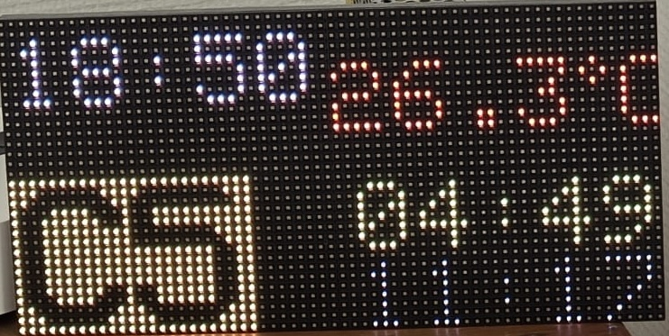
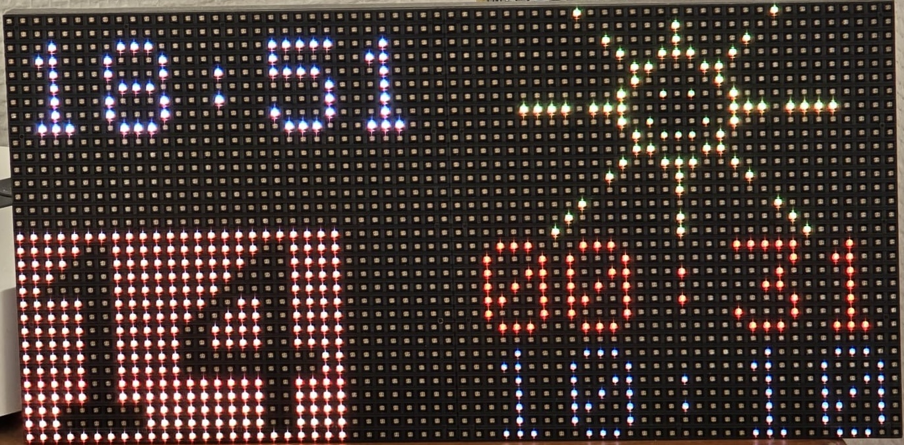

# ArduiMum

An Arduino Mega 2560 project that displays real-time information (bus, time and weather) on a 64x32 RGB LED matrix.

<video src="https://github.com/user-attachments/assets/3b89140a-0723-4620-99fe-7a29e3bc59c3" controls="controls" autoplay="autoplay" loop="loop" muted="muted" style="max-width:100%;">
  Votre navigateur ne supporte pas la lecture de vidéos HTML5.
</video>

## Overview

ArduiMum is an IoT display system that:
- Connects to the internet via an Ethernet shield
- Fetches data from a web API
- Displays weather, time, and other information on an RGB LED matrix
- Syncs time using NTP (Network Time Protocol)

## Demo

### Video
<video src="https://github.com/user-attachments/assets/1bf52050-51cb-4c1d-a350-9c1a7baf006a" controls="controls" autoplay="autoplay" loop="loop" muted="muted" style="max-width:100%;">
  Your browser does not support HTML5 video.
</video>

### Photos

## Hardware

- **Microcontroller:** Arduino Mega 2560
- **Display:** RGB LED Matrix (16x32 or similar)
- **Network:** Ethernet Shield
- **Schematics:** Available in the `MumBoard/` directory (Eagle format)

## Getting Started

1. Install [Arduino IDE](https://www.arduino.cc/en/software)
2. Install required libraries through Arduino IDE:
   - RGB matrix Panel by Adafruit
   - Adafruit GFX Library by Adafruit
   - Time by Michael Margolis
3. Set board to "Arduino Mega 2560"
4. Load `projetMum/projetMum.ino` and upload to the board

## Project Structure

- `projetMum/` — Main Arduino sketch and configuration
- `MumBoard/` — Hardware schematics and PCB design files
- `libraries/` — Custom and third-party libraries
- `pictures/` — Reference images and documentation

## License

Copyright © Perhan Scudeller
